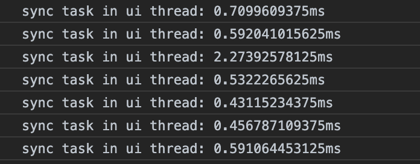
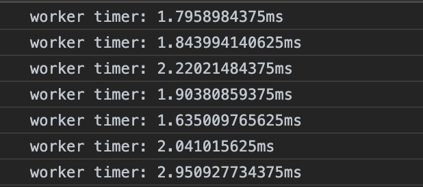
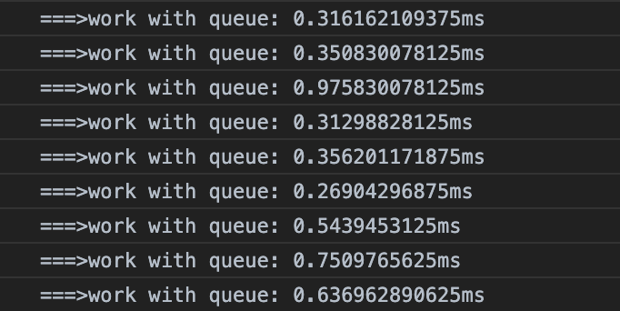

# 使用 Web Worker 来改善性能

在 Web Worker 之前，解析 CSS，生成布局，绘制界面以及运行 javascript 脚本都运行在浏览器的一个线程里。如果一个 Web App 运行的 js 脚本一次运行时间过长，就会出现界面卡顿。这样的用户体验是没法用及格来评价的。

在多核普及的当下，浏览器也大多支持了 Web Worker。这让前端开发有了更多的选择，使用 web worker 来实现真正的多线程。所有阻碍、延迟用户反馈的操作都可以移入一个后台运行的线程中。

## 如何发现性能瓶颈

笔者主要使用 React 开发，所以首先聊一下 React 中如何发现性能出现问题的地方。在 React16.9 中新增了 Profiler API，使用起来也非常简单，具体可以查看文档((https://reactjs.org/docs/profiler.html))。

更通用一点的可以使用 chrome 的*lighthouse*。可以安装插件 lighthouse 插件，或者也可以直接打开开发面板的*audits*点击*run audits*，就能看到报表了。`console.time`和`console.timeEnd`组合。

但是，以上只适用于开发模式下使用。在生产上使用多多少少会给产品本身带来额外的资源消耗。一般来说，app 都会有埋点，在埋点点时候如何顺道达成性能消耗点记录就需要具体问题具体分析了。

## Web Worker

使用 Web Worke 让阻塞代码在后台运行，自然不会阻塞 UI 线程（main thread）。在例子中所用到的是`typescript`版本的代码，所有后面如果有必要会给出在 typescript 实现的代码和相应的说明。配置一类的文件请直接移步到代码目录查看，这里就不多说了。

在 Worker 的部分使用了`webpack` + `worker-loader`的方式。`worker-loader`的具体内容可以参考[这里](https://github.com/webpack-contrib/worker-loader)。

### 创建一个 Worker

创建一个 Worker 非常的简单，只需要把一段命名脚本传给`Worker`构造函数就可以。比如 MDN 的一段：

这是 Worker 脚本：

```js
// worker.js
self.onmessage = event => {
  console.log("Message received", event.data);
  self.postMessage("Worker done");
};
```

在 typescript 里，首先需要处理 Worker 的上下文的问题，否则`tsc`编译不过。

```typescript
const ctx: DedicatedWorkerGlobalScope = self as any;

ctx.onmessage = (event: MessageEvent) => {
  //...

  ctx.postMessage("done");

  // Close the worker when jobs done
  ctx.close();
};

ctx.onerror = (event: ErrorEvent): any => {
  console.error("Error in worker", event.message);
  ctx.close();
};

export default null as any;
```

**注意**：这里需要使用`DedicatedWorkerGlobalScope`不能直接食欲哦那个`Worker`，因为`Worker`的定义里面没有`close`方法。这是因为`close`方法**deprecated**？

```
TS2339: Property 'close' does not exist on type 'Worker'.
```

还有在创建 Worker 的最后，需要一个`export`语句：

```typescript
export default null as any;
```

创建 Worker：

```js
// Main thread
var myWorker = new Worker("worker.js");

myWorker.postMessage([first.value, second.value]);

myWorker.onmessage = function(e) {
  result.textContent = e.data;
  console.log("Message received from worker");
};
```

Typescript:

```typescript
import SimpleWorker from "./simple.worker";
const worker = new SimpleWorker();
```

两个线程之间（上例是 UI thread 和一个 worker）可以通过`postMessage`和`onmessage`或者（`addEventListener('message', () => {}`）的方式来传递消息。

线程之间的通信是基于**事件**的。那么错误的处理也是同样道理，例如：

```js
// UI thread
var myWorker = new Worker("worker.js");

myWorker.onerror = function() {
  console.log("There is an error with your worker!");
};
```

```js
// Inside worker
self.onerror = err => {
  console.error("Error in worker", err);
};
```

#### 引入外部脚本

```js
importScripts(); /* imports nothing */
importScripts("foo.js"); /* imports just "foo.js" */
importScripts("foo.js", "bar.js"); /* imports two scripts */
importScripts(
  "//example.com/hello.js"
); /* You can import scripts from other origins */
```

**注意**：下载顺序可以是任意顺序，但是执行的顺序是按照脚本在`importScripts`方法里出现的顺序。

因为使用了`worker-loader`，在引入外部代码的时候，和一般的`import`差不多：

```typescript
import { ab2str, str2ab } from "./lib/utils"; // 引入内部依赖
import * as _ from "lodash"; // 引入外部依赖

ctx.onmessage = (event: MessageEvent) => {
  // ...
  const dataStr = ab2str(dataBuff); // 使用内部依赖

  // ...
  const target = JSON.parse(dataStr || '[]');
  const v = _.get(target, 'a.b', 'N/A');  // 使用外部依赖

  // ...
```

### 关闭一个 Worker

Worker 也占用和消耗资源，所以在不用的时候就要关闭它。

关闭一个 Worker 有两种方法：一种是直接在 UI thread 里面使用`terminate`方法，一种是在 Worker 的内部调用`close`方法。

```javascript
// In main thread
const worker = new Worker("myworker.js");

// If it's the time to terminate a worker
worker.terminate();
```

在调用了`terminate`方法之后，Worker 会被立刻终止，即使是还在运行中的也是一样。但是一般情况下还是希望在 Worker 执行完成之后才去关闭。这个时候就要用到 Worker 的`close`方法。

```javascript
// In a worker
self.onmessage = event => {
  self.close();
};
```

如上文所说，`close`方法就要被废弃了，现在是在*deprecated*的状态。具体看 MDN 的[这里](https://developer.mozilla.org/en-US/docs/Web/API/WorkerGlobalScope/close)

要被废弃是因为，在一个 worker 出了作用域之后就会被回收。所以有没有`close`这个方法并没有太大的必要。

### Inline Worker

Worker 的创建需要得到脚本的 URL 地址。一般情况下，这段脚本是放在 server 上的。这就需要网络的传输。如果只是一个简单的需要放到后台执行的脚本，如果可以打包到一起直接发布到客户浏览器会节省很多的时间。这个时候就需要 inline Worker。

它的创建也很简单，并没有什么特别的地方。只是在获得 URL 的时候使用了`Blob`这个工具，如：

```js
// URL.createObjectURL
window.URL = window.URL || window.webkitURL;

// "Server response", used in all examples
var response = "self.onmessage=function(e){postMessage('Worker: '+e.data);}";

var blob;
try {
  blob = new Blob([response], { type: "application/javascript" });
} catch (e) {
  // Backwards-compatibility
  window.BlobBuilder =
    window.BlobBuilder || window.WebKitBlobBuilder || window.MozBlobBuilder;
  blob = new BlobBuilder();
  blob.append(response);
  blob = blob.getBlob();
}
var worker = new Worker(URL.createObjectURL(blob));

// Test, used in all examples:
worker.onmessage = function(e) {
  alert("Response: " + e.data);
};
worker.postMessage("Test");
```

在 react hook 和 Worker 结合的一个 npm 包里就有过使用这种方法的代码。简单的把用户的 task（一个方法）转成字符串，之后通过`Blob`得到一个 URL 来创建出一个 Worker。其他使用 react hook 的工作机制通知 task 执行的结果。非常的简单有效。代码在[这里](https://github.com/dai-shi/react-hooks-worker/blob/8e797154668fc585f2b727651a3b47cabbd7e10e/src/index.js)。

节选部分代码，以飨读者：

```js
const createWorker = func => {
  if (func instanceof Worker) return func;
  if (typeof func === "string" && func.endsWith(".js")) return new Worker(func);
  const code = [
    `self.func = ${func.toString()};`,
    "self.onmessage = async (e) => {",
    "  const r = self.func(e.data);",
    "  if (r[Symbol.asyncIterator]) {",
    "    for await (const i of r) self.postMessage(i)",
    "  } else if (r[Symbol.iterator]){",
    "    for (const i of r) self.postMessage(i)",
    "  } else {",
    "    self.postMessage(await r)",
    "  }",
    "};"
  ];
  const blob = new Blob(code, { type: "text/javascript" });
  const url = URL.createObjectURL(blob);
  return new Worker(url);
};
```

现在这部分代码都交给 webpack 都插件来做了。

## Web Worker 不能做什么

首先 Web Worker 不能访问 UI thread 的 UI，也就是 DOM。
如果一个 Web Worker 可以访问 DOM，那加上 UI thread 就是两个或者两个以上的 Worker 可以访问 DOM 了，那就会出现非常麻烦的多线程特有的问题，而且调试困难。所以 DOM 肯定是不能访问的。

其他的还有很多限制可以参考[这里](https://developer.mozilla.org/zh-CN/docs/Web/API/Web_Workers_API/Functions_and_classes_available_to_workers)

但是，还是可以发出网络请求，可以`setTimeout`, `setInterval`，还是可以使用`Cache`和`IndexedDB`等等一些功能等。

Worker 虽好，也不能开的太多。Worker 是真正系统级的线程，要运行起来就需要有支撑的资源。在 Worker 之间传输的数据不能太大。为了避免多个 Thread 共享内存而导致的多线程问题，WeW Worker 传输数据的时候使用了两个方式：

1. 在多个 Worker 之间传输的数据是拷贝传输的。开发者不需要考虑这段数据的锁保护之类的事情。
2. 以拷贝的方式传输数据，数据量过大的时候拷贝消耗的资源也会很大。这个时候就要考虑使用`Transferable Object`。这种类型的数据在传输的时候基本不存在复制的动作，可以认为是 c++里的引用传递。不同的是 Worker 的`Transferable Object`在传递出去之后就当前上下文里即不可访问。

```js
// Create a 32MB "file" and fill it.
var uInt8Array = new Uint8Array(1024 * 1024 * 32); // 32MB
for (var i = 0; i < uInt8Array.length; ++i) {
  uInt8Array[i] = i;
}

worker.postMessage(uInt8Array.buffer, [uInt8Array.buffer]);
```

## 举个栗子

我们来把一个字符串反转多次来模拟 CPU “繁重”的任务。这个栗子分为三部分一个是运行在 UI thread 上看看会有多卡，一个是运行在`Promise`里，看看会有什么不同的结果。数据全部都是基于我们的栗子来得到，对于读者来说由于有些网络、硬件等情况不同或者不完全可控会有不同，定量分析不会那么准确，定性分析有一定的代表性。

同时，这个试验和样本的数量关系十分密切。在样本足够打的时候，试验只会收到异常。

### 测试数据是怎么来的

```typescript
const ITERATE_COUNT = 1000;
const STR_LEN = 3;

let queue: TaskQueue | null = null;

function prepareData(count: number = 1000, length: number = 10) {
  const data: Array<DataType> = [];
  for (let i = 0; i < count; i++) {
    const item = RandomString.generate(length);
    data.push({ key: `Key - ${i}`, val: item });
  }

  return data;
}

const rawData = prepareData(ITERATE_COUNT, STR_LEN);
(window as any).rawData = rawData;
```

上面的方法生成了 1000 个长度是 10 的字符串。在后面的例子里会把这些字符串全部反转。以此来模拟某种业务场景下繁重的 CPU 任务。

### 例一、在主线程

代码：

```typescript
// Demo 1: execute reverse string in ui thread
function execTaskSync() {
  console.time("sync task in ui thread");

  const target = rawData;
  for (let el of target) {
    const { val } = el;
    reverseString(val);
  }

  console.timeEnd("sync task in ui thread");
}

(window as any).execTaskSync = execTaskSync;
```

这个任务量其实不够大，只会产生一个和后面例子对比的效果。先运行一下看看结果：



运行结果看起来很快，如果需要更慢一些只需要把字符串数量或者字符串的长度调大就可以。运行的结果基本都在 0.xx ms 的范围内，只有一个是 2.27 ms。这也许只是一个现象，也许就很值得深究了。

### 在 Worker 运行

是时候让这个功能在 worker 里面运行一次了：

```typescript
ctx.onmessage = (event: MessageEvent) => {
  console.time("worker timer");

  const { target } = event.data as { target: DataType[] };
  for (let el of target) {
    const { val } = el;
    reverseString(val);
  }

  console.timeEnd("worker timer");

  ctx.postMessage("done");

  // Close the worker when jobs done
  self.close();
};
```

数据全部传过来之后，在 worker 连运行。结果是这样的：


### 在 Micro Queue 运行

看起来是一个 queue，不过是一个个 Promise 接连运行的。在本例中只有一个 Promise 运行。

Queue 是什么样的 Queue：

```typescript
class Queue {
  private _startExec() {
    const task = this._queue.shift();
    if (task) task.run();
  }

  next() {
    if (this._queue.length === 0) {
      return;
    }

    this._startExec();
  }

  async addTask(
    fun: (param: any) => any,
    data: any,
    resolve: (val: any) => void,
    reject: (err: any) => void
  ) {
    const run = async () => {
      try {
        const ret = await fun(data);
        resolve(ret);
      } catch (e) {
        reject(e);
      }

      this.next();
    };

    this._queue.push({ run } as Task);
    this._startExec();
  }
}
```

这个是在 Queue 里添加 task 的方法，在添加的时候就会在 task 运行完成之后调用 Queue 的 next 方法来开始下一个 task。

在数据量同样的情况下运行的结果：


看起来和在主线程的运行结果相当的接近了。我们来把数据量加大看看会有什么结果。

```js
const ITERATE_COUNT = 100000;
const STR_LEN = 300;
```

先把数量级提升到这个程度。

多次运行之后，主线程和放在 Promise 里的方式差别依然不大，只是在按钮点击之后明显的增加了等待的时间。在 Worker 里运行的花费时间比之主线程依然更多，但是按钮点击之后的等待时间并没有相应的更多等待。

### Run in Worker with Buffer

这就体现出 Worker 存在的意义了。相应用户点击的速度一定会快很多。这个时候就需要`Buffer`出场了。我们来测试一下使用了 Buffer 的 Worker 会出现什么样的惊喜。


明显在第一次消耗了很多时间之后，每次的调用都消耗了比直接调用 Worker 的`postMessage`更少的时间。使用 Buffer 来实现不同 Worker 之间传输数据就像是 C/C++的引用传递一样，这里不会涉及到数据的拷贝操作。所以节省了时间。

但是，在代码里：

```js
const dataStr = JSON.stringify(data);
const dataBuff = str2ab(dataStr);

const worker = new CachedWorker();
worker.postMessage(dataBuff, [dataBuff]);
```

其实包含了数据->字符串（json）->buffer 的转化过程。第一次花费的时间很多是在这些转化的过程中消耗的。但是后面，笔者认为是浏览器做了优化，还要继续查一下资料，所以花费的时间只有直接传输 buffer 花费的时间，所以大量减少。

**注意**：使用 Buffer 传输数据可以很大，比如在 Google 的某个例子中是 30M 多。但是，上文的例子中，传输的数据的大小受到了很大的限制。主要是在把 Buffer 的数据转化为 Object 的时候会出现异常。有兴趣的各位可以把数据的大小继续往大调这个异常就会出现。_所以，如何使用需要看具体的场景，比如，上例可以改为在 Worker 里请求得到二进制数据再做处理。_

### Transferable Object

传递 Buffer 的时候是按照 Transferable Object 传递的。这种数据是实现了`Transferable`接口的数据。这个接口就是一个标记的作用，表明实现了这个接口的数据可以如引用一般传递。

但是，此处的引用和 C/C++的引用是两回事。Transferable object 在完成不同的执行上下文（execution context）传输之后就不再可用了。H5 委员会为了 Worker 可以普及，默默的解决了多少使用多线程可能会出现的问题。

多次执行就不用说了，只执行一次的代码缓存起来也存粹是浪费空间。缓冲的命中率是说缓存的结果会被用到。如果缓存不会再被多次执行的某个功能用到，那么也是没有意义的。

在本例中，缓存的作用基本上大打折扣。字符串是随机生成的。用随机字符串为 Key 缓存的结果，基本上备用到的概率很小，而且随机字符串的数量比较大（这里是 1000）。那么在查找缓存字符串的时候也要便利 map 的大部分 Key。反而造成了不必要的多余计算。

所以，缓存需要根据代码的执行逻辑和缓存的命中率来判断是否需要。

## Worker 的使用离不开特定的场景

使用 Worker 或者不使用 Worker 都是要看具体的某个场景。新技术的产生一定是解决某个特定的问题的。在使用这项新技术之前至少要尽量真实的模拟需要解决的场景，来验证这个新的技术是否可行。比如，在本文使用的例子就是为了模拟笔者想要解决的问题的场景设立的。遇到的最大的问题是如果数据量达到某个临界值的时候，在 Worker 内部反序列化并组成 Object 的时候就会出现异常。而混存，因为 Key 值极大的可能是重复的，所以混存的使用就非常的有必要。在以上各种场景的模拟之后可以使用的各种技术的结合必然是缓存和使用`Buffer`传输数据。但是，数据量需要控制，不能出现反序列化的问题。

或者，直接从 Worker 里请求得到 JSON 的二进制串，比如[发送和接收二进制数据](https://developer.mozilla.org/zh-CN/docs/Web/API/XMLHttpRequest/Sending_and_Receiving_Binary_Data)。

所以，各种技术都有在特定场合下使用的优劣。这就需要我们具体结合场景具体分析。
