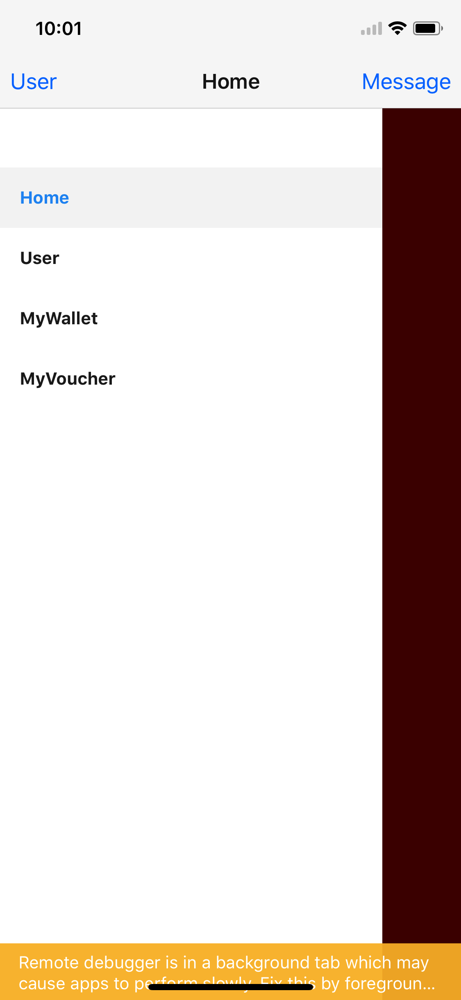
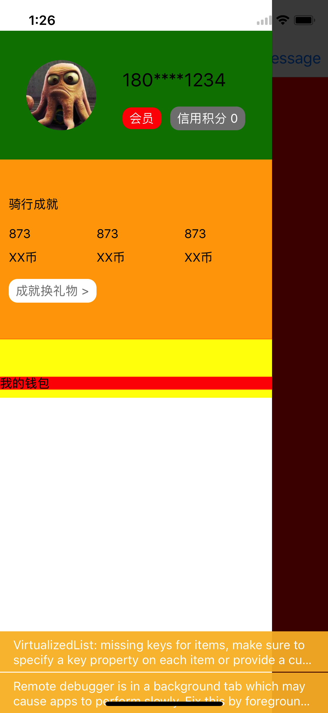
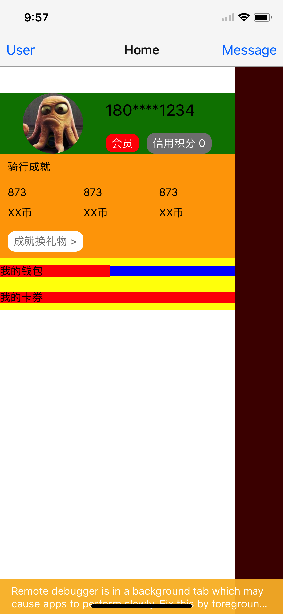

# React Native填坑之旅 -- 使用react-navigation代替Navigator
`Navigator`已经被React Native废弃了。也许你可以在另外的一个依赖库里[`react-native-deprecated-custom-components`](https://www.npmjs.com/package/react-native-deprecated-custom-components)里找到。不过既然官方推荐的是[`react-navigation`](https://reactnavigation.org/)那我们就来看看这个东西到底有什么好的，值不值得用。

一句话概括的话，`react-navigation`非常值得用。之前配置一个`Navigator`非常的繁琐，但是使用`react-navigation`的任何一个导航组件都非常简单。项目的github地址在[这里](https://github.com/futurechallenger/react-native-tutorial)。

`react-navigation`包括下面三个Navigator： 
* `StackNavigator`: 这个组件是用来代替之前的`Navigator`的。凡是维持一种“先进后厨”的栈式导航的话就可以用这个。
* `TabNavigator`：这个组件和iOS的`TabBarController。看起来是这样的。
* `DrawerNavigator`：这个组件就是抽屉式的导航菜单。在React Native里只有Android才有：`DrawerLayoutAndroid`，在iOS里是没有的。有了`DrawerNavigator`，两个平台都可以用了。

我会在下文里主要介绍`StackNavigator`和`DrawerNavigator`。对于`TabNavigatgor`它的使用非常简单，当你回了前面的两种的时候你就自然可以搞定它了。

## Stack Navigator
在
```
react-native init AwesomeProject
```
命令后生成的默认项目里，查看*index.js*文件：
```javascript
import { AppRegistry } from 'react-native';
import App from './App';

AppRegistry.registerComponent('AwesomeProject', () => App);
```
APP开始执行后运行的就是`App`组件。也就是*App.js*文件export的是什么组件，App就运行什么组件。

在*App.js*文件中，去掉`export default`。就如我们的demo做的一样，添加一个*MessageContainer.js*文件，并添加demo中的内容。这样在其中我们已经有了`App`、`MessageContainer`两个组件。

下面看下如何配置。

最简单的：
```javascript
export default NavHome = StackNavigator({
  Home: {
    screen: NavApp,
  },
  Message: {
    screen: MessageContainer,
  },
})
```
导出`StackNavigator`方法生成的组件`NavHome`。运行起来之后，理论上就可以导航了。但是会有问题，因为这时还没有能够跳转的触发点。所以，我们还要做如下的修改。

修改*App.js*文件的内容。在其中添加一个按钮，点击之后可以进入到`MessageContainer`组件。修改*MessageContainer.js*文件，在里面添加一个按钮返回。
```javascript
//App.js
<Button onPress={this.props.navigation.navigate('Message')} title={'To message'} />

//MessageContainer.js
<Button onPress={this.props.navigation.goBack()} title={'Go Back'} />
```

但是，这样还是demo的水平，离真正的产品级使用还差很多。一般的App，在push到下一个页面的时候会点击navigation bar的回退按钮返回上一页。我们就来实现这个功能。

使我们首先看一下`StackNavigator`的API：
```javascript
StackNavigator(RouteConfigs, StackNavigatorConfig)
```
通过查看文档，要实现这个功能需要在`RouteConfigs`里面增加`navigationOptions`来达到。如下：
```js
export default NavHome = StackNavigator({
  Home: {
    screen: App,
    navigationOptions: ({navigation}) => ({
      title: 'Home',
      headerLeft: (<Button onPress={() => navigation.navigate('DrawerToggle')} title={'User'} />),
      headerRight: (<Button onPress={() => navigation.navigate('Message')} title={'Message'} />),
    })
  },
  Message: {
    screen: MessageContainer,
    navigationOptions: ({navigation}) => ({
      title: "Message",
      headerLeft: (<Button title='Back' onPress={() => {navigation.goBack();}} />)
    })
  },
});
```
详细看一下`navigationOptions`。
1. title：是导航栏上显示的title。
2. headerLeft： 是导航栏左侧的组件。我这里放了一个按钮。更好的是放置一个`TouchableOpacity`组件。因为按钮在iOS上还好，但是在Android上就是一个明晃晃的按钮啊，各种边框和阴影。
3. headerRight: 是导航栏右侧的组件。

在`MessageContainer`的导航栏上就只需要一个“返回”按钮，所以只有一个`headerLeft`就足够了。在首页上的导航栏的`headerLeft`是用来触发稍后讲到的`DrawerNavigator`的。

这样，这个靠谱的导航就完成了。

## Drawer Navigator
`DrawerNavigator`和`StackNavigator`的配置很类似。
```js
const NavApp = DrawerNavigator({
  Home: {
    screen: App,
  },
  MyWallet: {
    screen: MyWalletView,
  },
  MyVoucher: {
    screen: MyVoucherView,
  }
});
```
这个时候看起来是这样的：
<!--  -->


但是我想要的效果是这样的：



显然，文档里提供的一些简单的定制是不能完成这样的效果的。于是，我们查看文档，发现有办法直接替换掉默认的Drawer实现，非常简单：
```js
const NavApp = DrawerNavigator({
  Home: {
    screen: App,
  },
  User: {
    screen: UserContainer,
  },
  MyWallet: {
    screen: MyWalletView,
  },
  MyVoucher: {
    screen: MyVoucherView,
  }
}, {
   contentComponent: props => (<UserDrawer items={props} />)
})
```
看下API：
```js
DrawerNavigator(RouteConfigs, DrawerNavigatorConfig)
```
只要叫上`DrawerNavigatorConfig`配置里的`contentComponent`配置。也就是上面配置的第二个参数。
```js
{
   contentComponent: props => (<UserDrawer items={props} />)
}
```
`contentComponent`就是drawer的内容组件。这里我们用的是`UserDrawer`组件，并把props传递了进去。

这样我们想要的抽屉式菜单就实现了。

## StackNavigator和DrawerNavigator结合使用
现在把这两个组件结合在一起使用。在首页上的导航栏里的两个按钮，左侧的开启drawer导航，右侧的是“message”按钮，使用StackNavigator组件导航。

如果是在drawer导航里使用`StackNavigator`的话，那么只要这样配置：
```js
export default NavHome = StackNavigator({
  Home: {
    screen: NavApp,
    navigationOptions: ({navigation}) => ({
      title: 'Home',
      headerLeft: (<Button onPress={() => navigation.navigate('DrawerToggle')} title={'User'} />),
      headerRight: (<Button onPress={() => navigation.navigate('Message')} title={'Message'} />),
    })
  },
  Message: {
    screen: MessageContainer,
    navigationOptions: ({navigation}) => ({
      title: "Message",
      headerLeft: (<Button title='Back' onPress={() => {navigation.goBack();}} />)
    })
  },
});

export default NavApp = DrawerNavigator({
  Home: {
    screen: NavHome, // ***
  },
  MyWallet: {
    screen: MyWalletView,
  },
  MyVoucher: {
    screen: MyVoucherView,
  }
}, {
   contentComponent: props => (<UserDrawer items={props} />)
})
```
要在Drawer导航里用stack导航，那么就在drawer导航里的某个路由选项里加上`screen: NavHome`。这个`NavHome`就是stack导航。反之，则是在stack导航里的某个route选项的screen上指定drawer导航。

但是在使用上还是有一点区别的。如果drawer导航里包含stack导航。那么drawer导航菜单的最高点是在屏幕的最高点。反之，如果drawer导航被stack导航包含的话，drawer导航菜单的最高点是在导航栏的下方的。如图：


drawer导航包含stack导航



drawer导航被stack导航包含

回到正题。从drawer导航菜单跳转到任何的页面后如何跳转回来呢？还是老方法：
```js
export default class MyWalletView extends React.Component {
  render() {
    return (
      <TouchableOpacity 
        style={{ flex: 1, justifyContent: 'center', alignItems: 'center' }}
        onPress={() => this.props.navigation.goBack()}>
        <Text>{'My Wallet'}</Text>
      </TouchableOpacity>
    );
  }
}
```
调用props传入的navigation的方法来实现返回：
```js
this.props.navigation.goBack()
```

## 总结
更多请看代码吧。留下来`TabNavigator`来给各位读者朋友实践一下练练手吧。其实配置的简单程度比早前React Native里的Navigator已经降低了很多了。

`StackNavigator`里还有除了`navigate()`和`goBack()`两个方法之外，还有其他的一些方法可以调用。实际的App交互中也并不是只有导航到某一页，然后再从那一页跳转回来这么简单。后面有机会会讲到这方面的内容。
